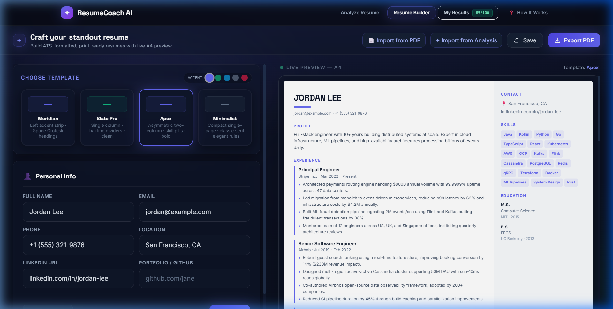
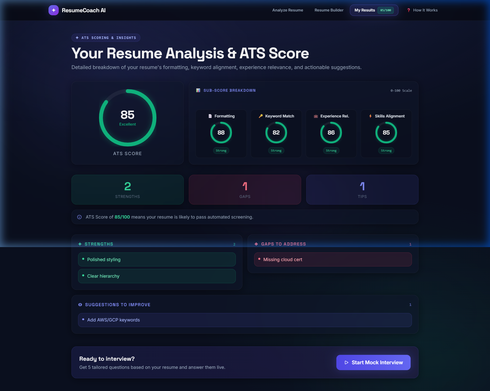
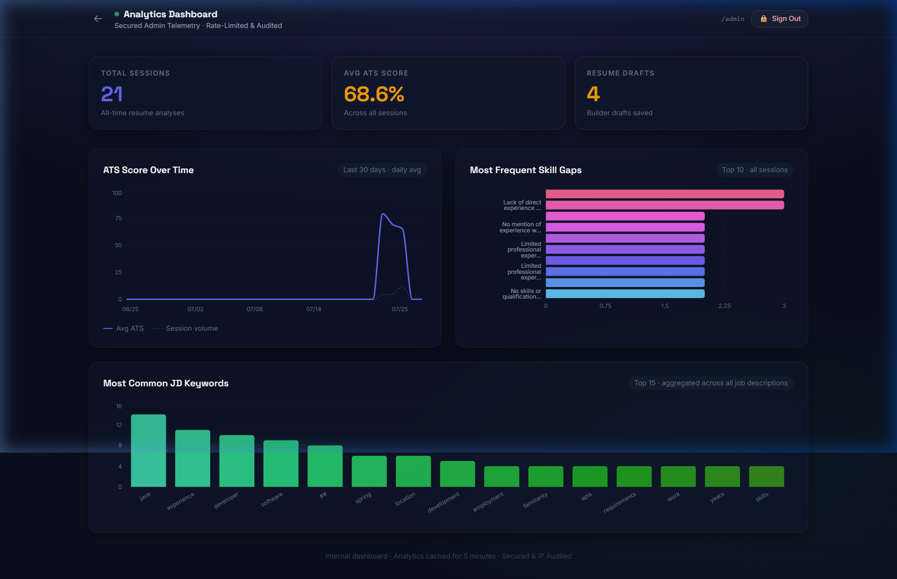

# AI Resume & Mock Interview Coach

An intelligent, full-stack application designed to help job seekers build ATS-optimized resumes, receive instant AI feedback, practice mock interviews with real-time evaluation, and monitor system-wide resume analytics.

---

## 🌟 Overview

The **AI Resume & Mock Interview Coach** combines interactive resume authoring, server-side PDF ingestion, AI-driven ATS (Applicant Tracking System) scoring, role-tailored mock interview simulation, and a hardened security-audited analytics portal.

### Key Highlights
- **Interactive Resume Builder**: Real-time A4 page preview, multi-template styling, automatic page boundary detection, dynamic field improvement, and client-side multi-page PDF export (`html2pdf.js`).
- **PDF Resume Ingestion**: Server-side document extraction powered by **Apache PDFBox** to automatically map uploaded resumes into editable builder structures.
- **AI ATS Scoring & Analysis**: Uses Groq's **Llama 3.3 70B** model to analyze resumes against target Job Descriptions, extracting keyword match percentages, missing core competencies, and section-by-section improvement strategies.
- **AI Mock Interview Coach**: Generates dynamic technical and behavioral interview questions tailored to the candidate's background and target job description, rating user responses on clarity, relevancy, and STAR methodology.
- **Hardened Admin Analytics**: Secured administrative dashboard visualizing ATS trends over time, top missing skill gaps, and in-demand keywords across analyzed job descriptions.

---

## 📸 Screenshots


*Figure 1: Resume Builder with real-time A4 preview, dynamic page-break indicators, and multi-page PDF export.*


*Figure 2: AI ATS Analysis displaying match scores, keyword gaps, and actionable recommendations.*


*Figure 3: Hardened Admin Analytics Dashboard showing aggregate metrics, ATS score distribution, and top skill gap charts.*

---

## 🛠️ Technology Stack

### Frontend
- **Framework**: React 19 + Vite
- **Styling**: Custom CSS Design System (dark-mode glassmorphism, responsive grid, dynamic micro-animations)
- **Icons**: Lucide React
- **PDF Export**: `html2pdf.js` & `html2canvas` (with print-budget layout protection and break-inside prevention)

### Backend
- **Framework**: Spring Boot 3.4 (Java 17+)
- **Database**: MongoDB (Spring Data MongoDB)
- **AI Engine**: Groq REST API (`llama-3.3-70b-versatile`)
- **PDF Processing**: Apache PDFBox 3.0
- **Logging**: Logback with dedicated isolated security audit logger (`logs/admin_audit.log`)

---

## 🔐 Security & Hardening Features

The Admin Analytics portal incorporates multi-layered security protections:
1. **Unlisted Access**: Admin routes are unlisted from public navigation and require explicit credential authentication.
2. **Constant-Time Comparison**: Credential validation uses `MessageDigest.isEqual` to prevent timing side-channel attacks.
3. **IP Rate-Limiting**: Enforces a sliding window rate-limit (maximum 5 failed attempts per 15 minutes per IP).
4. **Token Security at Rest**: Active session tokens are stored in memory and on disk exclusively as **SHA-256 cryptographic hashes**.
5. **Disk State Persistence**: Lockout state and token expiration timestamps survive application restarts (`logs/admin_security_state.json`).
6. **Isolated Audit Log**: Security audit events (`[ADMIN AUDIT]`) are routed to a dedicated Logback appender (`logs/admin_audit.log`) with zero application log pollution.

---

## 📌 Project Status & Scope

> **Note**: This project is built as a **showcase / demonstration application**.
> User sessions in the Resume Builder and Mock Interview module are **anonymous and browser-local by design** (stored in browser state/session without requiring multi-tenant user account registration). Admin analytics access is protected via dedicated backend credentials.

---

## 🚀 Getting Started

### Prerequisites
- **Java 17** or higher
- **Maven 3.8+**
- **Node.js 18+** & npm
- **MongoDB** running locally on default port `27017` (or remote URI)
- **Groq API Key** (Free tier available at [console.groq.com](https://console.groq.com/keys))

---

### Step 1: Environment Setup

Create a `.env` file at the root directory by copying `.env.example`:

```bash
cp .env.example .env
```

Edit `.env` and set your credentials:

```ini
GROQ_API_KEY=gsk_your_actual_groq_api_key
ADMIN_ANALYTICS_SECRET=YourSecureAdminSecretKey2026!
MONGODB_URI=mongodb://localhost:27017/resume_coach
PORT=8080
```

---

### Step 2: Run the Backend

```bash
cd backend
mvn spring-boot:run
```

The Spring Boot backend will start on **http://localhost:8080**.

---

### Step 3: Run the Frontend

In a new terminal window:

```bash
cd frontend
npm install
npm run dev
```

Open your browser at **http://localhost:5173**. Vite's dev server automatically proxies `/api/*` requests to the Spring Boot backend on port 8080.

---

## 📂 Project Structure

```text
AI Resume & Mock Interview Coach/
├── backend/
│   ├── src/main/java/com/resumecoach/
│   │   ├── config/          # Web & Security CORS configurations
│   │   ├── controller/      # REST API Controllers (Resume, Interview, Builder, Admin)
│   │   ├── interceptor/     # AdminAuthInterceptor for route protection
│   │   ├── model/           # MongoDB Entities & DTO Data Models
│   │   ├── repository/      # Spring Data Mongo Repositories
│   │   └── service/         # Business Logic (Groq AI, PDFBox Parsing, Admin Auth)
│   ├── src/main/resources/
│   │   ├── application.properties
│   │   └── logback-spring.xml   # Dedicated [ADMIN AUDIT] Logback appender
│   └── pom.xml
│
├── frontend/
│   ├── src/
│   │   ├── api/             # Centralized Axios API client
│   │   ├── components/      # Navigation, Resume Preview, Hardened Lockscreen
│   │   ├── pages/           # Builder, Upload, Feedback, Interview, Admin Analytics
│   │   ├── App.jsx
│   │   └── index.css        # Core Design System, A4 Print Budget CSS, PDF Export mode
│   ├── package.json
│   └── vite.config.js
│
├── .env.example
├── .gitignore
└── README.md
```

---

## 📄 License

This showcase project is open source and available under the [MIT License](LICENSE).
